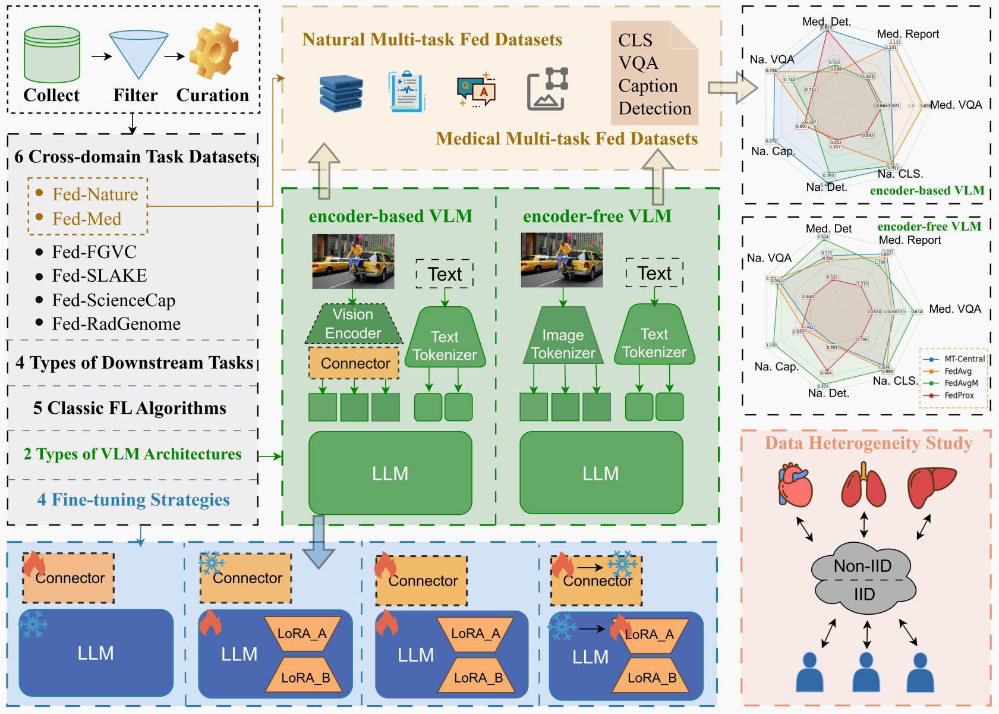

# FedVLMBench: Benchmarking Federated Fine-Tuning of Vision Language Models

**OpenFedLLM** is a systematic benchmark for federated fine-tuning of VLMs. Please check our [paper](https://arxiv.org/abs/2506.09638) for details and the corresponding empirical study.

FedVLMBench integrates two mainstream VLM architectures (encoder-based and encoder-free), four fine-tuning strategies, five FL algorithms, six multimodal datasets spanning four cross-domain single-task scenarios and two cross-domain multitask settings, covering four distinct downstream task categories. 



## Table of Contents
- [Prerequisites](#prerequisites)
- [Installation](#installation)
- [Configuration](#configuration)
- [Downloading](#Downloading)
- [Running Experiments](#running-experiments)
- [License](#license)

## Prerequisites

- Linux operating system
- NVIDIA GPU with CUDA capability
- Conda package manager
- Python 3.8+

## Installation

### 1. Set Up Conda Environment

```
conda env create -f env.yaml
conda activate fedvlm
```

### 2. Configuration
#### Code
```
/OpenFedLLM-main
├── /Nature_Multi
│   ├── main_encoder_based_fed_natural.py
│   ├── main_encoder_free_fed_natural.py
│   ├── main_encoder_based_local_natural.py
│   └── main_encoder_free_local_natural.py
├── /FGVC
│   ├── main_encoder_based_fed_fgvc.py
│   ├── main_encoder_free_fed_fgvc.py
│   ├── main_encoder_based_local_fgvc.py
│   └── main_encoder_free_local_fgvc.py
└── /gen_config
    ├── /encoder_free
    │   ├── gen_Natural_Multi_config.py
    │   └── gen_FGVC_config.py
    └── /encoder_based
        ├── gen_FGVC_config.py
        └── gen_Nature_Multi_config.py
```

#### Fed-FGVC
 <sub>*A Classification Vision-Language FL Dataset with 9,967 instances*</sub>
```
/Fed-FGVC
├── /clients
│   ├── /train
│   └── /test
└── /central_training
    ├── /train
    └── /test
```

#### Fed-Nature.
 <sub>*A Natural Multitask Vision-Language FL Dataset with 24,000 instances, integrating three public vision-language datasets — COCO(classification), RefCOCO(visual grounding and captioning generation), and COCO-QA(VQA)*</sub>
```
/Fed-Nature
├── /clients
│   ├── /train
│   └── /test
└── /central_training
    ├── /train
    └── /test
```

#### Fed-Med
 <sub>*A Medical Multitask Vision-Language FL Dataset with 20,590 instnces. Fed-Med unifies chest-related medical question answering, detection, report generation, and various other data sourced from the SLAKE (VQA), MIMIC-CXR (report generation), VQA-RAD (VQA), and RadGenome-Chest CT(detection) datasets.*</sub>
```
/Fed-Med
├── /image
│   ├── /MIMIC-CXR
│   ├── /RadGnome
│   ├── /slake
│   └── /RAD-VQA
├── /clients
│   ├── /train
│   └── /test
└── /central_training
    ├── /train
    └── /test
```

#### Fed-RadGenome
 <sub>*A Visual Detection Vision-Language FL Dataset with 8,744 instances*</sub>
```
/Fed-RadGenome
├── /clients
│   ├── /train
│   └── /test
└── /central_training
    ├── /train
    └── /test
```


#### Fed-ScienceCap
 <sub>*A Caption Generation Vision-Language FL Dataset with 5,157 instances*</sub>
```
/Fed-ScienceCap
├── /clients
│   ├── /train
│   └── /test
└── /central_training
    ├── /train
    └── /test
```

### 3. Downloading

#### Step1: Download Models
First, Download the models in the ./pretrained_models 
##### LLaMA-Instruct 3.2 3B
```
from transformers import AutoTokenizer, AutoModelForCausalLM
tokenizer = AutoTokenizer.from_pretrained("meta-llama/Llama-3.2-3B-Instruct")
model = AutoModelForCausalLM.from_pretrained("meta-llama/Llama-3.2-3B-Instruct")
```

##### CLIP ViT-B-32

```
from transformers import AutoProcessor, AutoModelForZeroShotImageClassification
processor = AutoProcessor.from_pretrained("openai/clip-vit-base-patch32")
model = AutoModelForZeroShotImageClassification.from_pretrained("openai/clip-vit-base-patch32")
```
##### Show-o 1.5B
https://huggingface.co/showlab/show-o-512x512/tree/main

#### Step2: Download Images
Download the images in the ./images

##### Natural Image Datasets
1. **FGVC Aircraft** [download](https://www.robots.ox.ac.uk/~vgg/data/fgvc-aircraft/)  
   <sub>*10,200 aircraft images with fine-grained annotations*</sub>

2. **COCO** [download](https://cocodataset.org/#home)  
   <sub>*330K images for object detection/segmentation*</sub>

3. **RefCOCO** [download](https://github.com/lichengunc/refer)  
   <sub>*142K referring expressions for 50K COCO images*</sub>

4. **COCO-QA** [download](https://www.cs.toronto.edu/~mren/research/imageqa/data/cocoqa/)  
   <sub>*78K visual questions based on COCO images*</sub>

5. **ScienceQA** [download](https://scienceqa.github.io/)  
   <sub>*21K multimodal science questions with explanations*</sub>

##### Medical Imaging Datasets
6. **RadGenome-ChestCT** [download](https://huggingface.co/datasets/RadGenome/RadGenome-ChestCT)  
   <sub>*3D CT scans with anatomical structure annotations*</sub>

7. **VQA-RAD** [download](https://huggingface.co/datasets/flaviagiammarino/vqa-rad)  
   <sub>*315 medical images with clinical QA pairs*</sub>

8. **MIMIC-CXR** [download](https://physionet.org/content/mimic-cxr/2.1.0/)  
   <sub>*377K chest radiographs with free-text reports*</sub>

9. **SLAKE** [download](https://www.med-vqa.com/slake/)  
   <sub>*642 medical images with bilingual (EN/ZH) QA pairs*</sub>


### 4. Running Experiments

#### Step1: Generate Configuration Files
Generate your configuration files before running experiments:
```
# Generate Natural_Multi configs
python gen_config/encoder_free/gen_Natural_Multi_config.py
python gen_config/encoder_based/gen_Natural_Multi_config.py

# Generate FGVC configs  
python gen_config/encoder_free/gen_FGVC_config.py
python gen_config/encoder_based/gen_FGVC_config.py
```


#### Step2: Run Training Experiments
```
# Federated training (encoder_free VLM)
python Nature_Multi/main_encoder_free_fed_natural.py --config_path ./Nature_Multi/encoder_free/fedavg_auto/config.yaml

# Federated training (encoder-based VLM) 
python Nature_Multi/main_encoder_based_fed_natural.py --config_path ./Nature_Multi/encoder_based/fedavg_auto/config.yaml


# Federated training (encoder_free VLM)
python Nature_Multi/main_encoder_free_local_natural.py --config_path ./Nature_Multi/encoder_free/fedavg_auto/config.yaml

# Central training (encoder-based VLM)
python Nature_Multi/main_encoder_based_fed_natural.py --config_path ./Nature_Multi/encoder_based/cent_auto/pro_lora_config.yaml

```


### Citation
If you find FedVLMbench useful for your research or development, please cite the following <a href="https://arxiv.org/abs/2506.09638" target="_blank">paper</a>:
```
@article{federatedscope,
  title = {FederatedScope: A Flexible Federated Learning Platform for Heterogeneity},
  author = {Xie, Yuexiang and Wang, Zhen and Gao, Dawei and Chen, Daoyuan and Yao, Liuyi and Kuang, Weirui and Li, Yaliang and Ding, Bolin and Zhou, Jingren},
  journal={Proceedings of the VLDB Endowment},
  volume={16},
  number={5},
  pages={1059--1072},
  year={2023}
```
